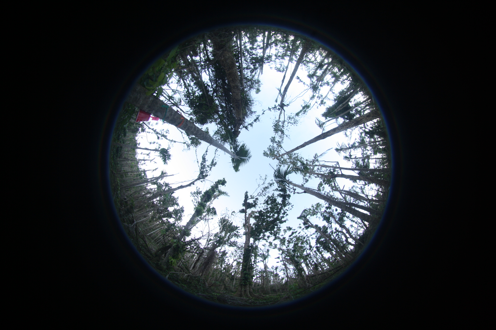
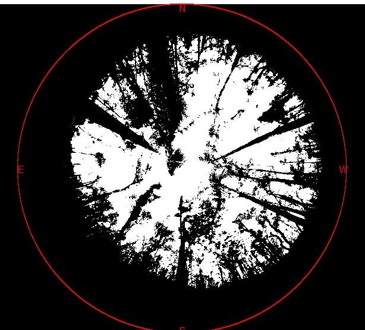

# Canopy Openness from Hemispheric Photos

## Project proposal outline for EEEB 4050, Spring 2021 (in development)
---

### Description of Project Goal:
Canopy openness - the amount of light penetrating a canopy - is a crucial metric in understanding ecosystem dynamics and function, especially after a disturbance like a fire or a cyclone.

This package assists foresters by taking an input of hemispheric photos, calculating canopy openness for the photos, and outputting a dataframe with the results, as well as pretty plots. This works on single images or for a batch mode using a directory full of images.

Currently there is a demo Jupyter Notebook found in the package for a user to try and test out the functions on their own images.

### File structure of package:

```bash
.
├── CanopyOpenness
│   ├── CanOpen.py
│   ├── CanOpenness Demo Script.ipynb     
│   ├── CanopyOpenness.py
│   ├── FishEye.py
│   ├── ImageLoad.py
│   └── __init__.py 
├── examples
│   ├── Batch_Test
│   ├── Sample_Photo.JPG
│   └── Sample_Photo_Threshold.jpg   
├── README.md
├── WorkingExample.ipynb
├── proposal.md
├── paired-programming-demo.ipynb
├── paired-programming.md
└── setup.py

```
The *CanopyOpenness* folder contains the modules for the package and the init file.
   - So far `ImageLoad.py`,`FishEye.py`  and  `CanopyOpenness.py` are up and running. These are meant to run sequentially 
     - `ImageLoad.py` takes a filepath and loads an image, thresholds it, and turns into black and white (canopy vs. sky)
     - `FishEye.py` takes the bw photo and outlines the fisheye lens circle, allowing users to adjust if necessary
     - `CanopyOpenness.py` takes the segmented circle in the bw photo and calculates the amount of light entering the canopy as a fraction from 1.
   - `CanOpen.py` is a script to test out class objects, and `CanOpenness Demo Script.ipynb` is a jupyter notebook that outputs tests of that script.

The *examples* folder contains sample photos used to test code and photos for users to test out the package.

The root branch of the repo has:
   - a README file with instructions for installations and brief description of the package
   - a written proposal for the project: `proposal.md` with more details (i.e. this file you're reading right now:)  
   - a jupyter notebook `WorkingExample.ipynb` with a basic workflow for users to see how the package works  
   - two `paired-programming` files with comments from peers and code suggestions (thank you Scarlet Au and Catherine Lan!)
   - a `setup.py` file that allows installation of the in-development package in a user's machine
 
Dependencies and libraries for this package include:
  1. `pandas`: to output and store results in a dataframe  
  2. `numpy`: to carry out statistical calculations 
  3. `skimage`: to manipulate photos and threshold colors in inputted images  
  4. `pathlib`, `os`, `glob` & `natsort`: to handle multiple files at once from a directory
  5. `matplotlib`: to display results and images
  6. `loguru` to log messages 

### User Input and Interface
The program requires the user to input image files. These will be jpeg or png files and should be fisheye photos.

For example:



The photo is then loaded and saved to be manipulated. This can be easily achieved once the program is loaded into a notebook/script/command line. 

An example below:

```
#import program
import CanopyOpenness

#load single image and turn into black and white (canopy vs. sky)
image = CanopyOpenness.ImageLoad.ImagePrep("./images/[image name].jpg)

#calculate fisheye coordinates to only look at the proper image
image = CanopyOpenness.FishEye.FishEye(image)

#calculate openness as fraction sky (i.e. white) in the fisheye lens image (overkill with module and class object names, I know)
openness = CanopyOpenness.CanopyOpenness.CanopyOpenness(image)

#alternatively, can load all images from single directory and run the above functions on all images, returning a csv with results
batch_images = CanopyOpenness.BatchLoad("images/",pattern = ".JPEG")

```
Therefore this program uses a Python API so users can interactively tweak and view results to fit their preferred use.

### Description of Data:
**Inputs -** 
   - jpeg or png files of hemispheric photos
   - location, date, and/or other identifying information of each photo (either in csv file or in the photo file name)  

**Outputs -** 
   - jpegs or png files of plots of canopy openness
   - csv file of openness per photo with columns identifying location/time of each photo

A csv output example:

| Photo | Plot | lon  | Month | Canopy_Openness |
|-------|------|------|-------|-----------------|
| 1A    | LFDP |73.4  | May   | 64.5            |
| 1B    | LFDP |73.45 | May   | 34.7            |

A photo example showing black and white for canopy vs. sky:



**Output locations -**
The user will be able to save the resultant csv and plots into a directory of their choosing, whether in a remote server or on their own machine by choosing a filepath.

This program design and output type is following ter Steege, Han (2021) at the *Naturalis Biodiversity Center, Leiden, The Netherlands*

### Description of Code:
The program will contain a module with a few different class types to calculate canopy openness from hemispheric photos and output them as csv (for more detail please see CanOpen.py in the CanOpenness folder):
   - Class to load and prepare images from user:
     - Using scikit-image package, will load image
     - Convert image to our format, by using image dimensions to locate center of circle and border
     - Choose blue channel from RGB to highlight difference between sky and canopy
     - Convert to binary black and white canopy vs. sky (how to pick threshold?)
   - Class to calculate what is *sunlight* and what is *not sun* (white vs. black)
     - Break image into smaller spheres, calculate area of sunlight in each
     - Add all fraction calculations and divide by total area of photo to give canopy openness value
   - Class to plot images
     - Takes input from raw image, image converted to blue channel, or image converted to black and white, and plot it using toyplot 
   - Class to save outputs
     - Iterate through image files in a given directory to calculate canopy openness, store the result in csv
     - Given user input filepath save csv to given filepath
     - Option to save plots as image files in a given directory
